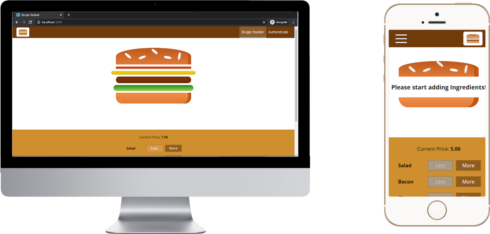

# Burger Builder
This is a funny React application where you can log in, build and order a custom burger. It's optimized to work on mobile devices and was created using [Create React App](https://github.com/facebook/create-react-app).



## Getting started
### Prerequisites

- [Firebase](https://firebase.google.com/) project (free)
- `node` >= 8.10
- `yarn` >= 0.25

### Create Firebase Project
This project needs a Firebase Project to run. Firebase is a platform powered by Google that provides some BaaS (Backend as a Service) features that allows mobile and web developers to keep focus on their applications without concern about backend freatures implementation. I this case we will use **Authentication** and **Database**.

Access the firebase [documentation](https://firebase.google.com/docs), create a new project and replace the values in `.env` file with your project information:
```
REACT_APP_FIREBASE_PROJECT_URL="https://YOUR_PROJECT_NAME.firebaseio.com/"
REACT_APP_FIREBASE_API_KEY="YOUR_FIREBASE_API_KEY"
```

### Install dependencies

In the project directory, run:

```
yarn
```

To install all the project dependencies.


## Run the Application

In the project directory, you can run:
```
yarn start
```

Runs the app in the development mode.
Open http://localhost:3000 to view it in the browser.

The page will reload if you make edits.
You will also see any lint errors in the console.
yarn
## License
**Burger Builder** is open source software [licensed as MIT](https://github.com/davipviana/burger-builder/blob/master/LICENSE).